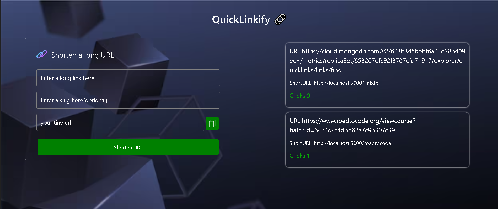

## QuickLinkify 🔗

QuickLinkify 🔗 is a tool build using React.js and RESTFULL APIS using node.js used to shorten a long link and create a short URL easy to share on sites, chat and emails. URL Shortener: Long Links, No Problem. Sick of those never-ending URLs? Say goodbye to the hassle with short url – the easiest way to transform your lengthy links into bite-sized.

### Live demo 

click here 👉:[https://quicklinkfyj.onrender.com/](https://quicklinkfyj.onrender.com/)